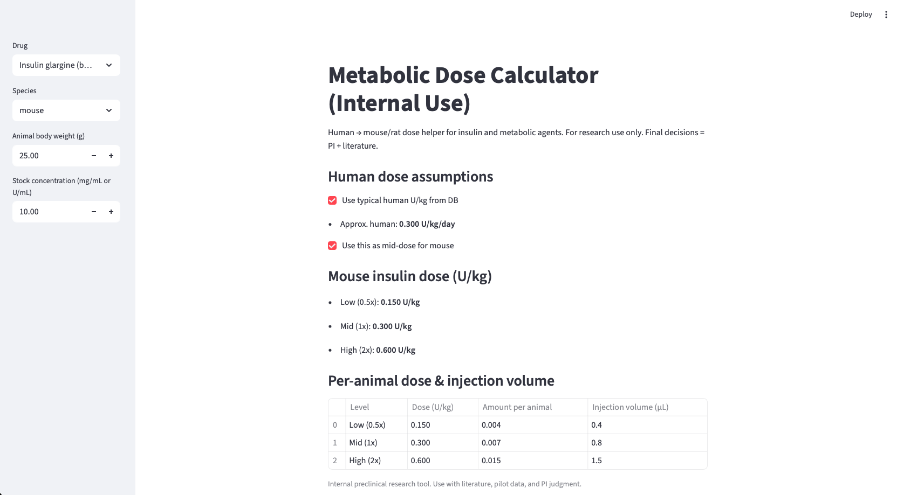

# Animal Dose Calculator

A lab-focused web application to make **preclinical dosing design** more rigorous, transparent, and reproducible.

<<<<<<< HEAD
<<<<<<< HEAD
This tool was built to solve a very practical problem I repeatedly encountered in a metabolism/endocrinology lab:  
=======
This tool was built to solve a very practical problem I repeatedly encountered in a metabolism/endocrinology lab:
>>>>>>> 4a2a533 (Add author and academic context)
=======
This tool was built to solve a very practical problem I repeatedly encountered in a metabolism/endocrinology lab:  
>>>>>>> dac4566 (Add author and academic context)
every time we designed an animal experiment based on human data, we were re-deriving the same allometric conversions and dose calculations by hand, often with slightly different assumptions each time.

I designed and implemented this calculator to standardize that process and to embed **clinical pharmacology thinking** directly into day-to-day wet-lab work.

---

## 🔍 Motivation & Scientific Context

In translational metabolism projects (e.g. insulin signaling, hepatokines, PPAR agonists), dose selection for mice or other species is often based on:

<<<<<<< HEAD
<<<<<<< HEAD
- Informal copying from prior papers without clear documentation of assumptions  
- Simplistic mg/kg rules that ignore species differences in exposure  
=======
- Informal copying from prior papers without clear documentation of assumptions
- Simplistic mg/kg rules that ignore species differences in exposure
>>>>>>> 4a2a533 (Add author and academic context)
=======
- Informal copying from prior papers without clear documentation of assumptions  
- Simplistic mg/kg rules that ignore species differences in exposure  
>>>>>>> dac4566 (Add author and academic context)
- One-off Excel sheets that are hard to reproduce or audit later

This creates several problems:

<<<<<<< HEAD
<<<<<<< HEAD
- Reviewers reasonably ask:  
  *“How did you choose this dose, and is it clinically relevant?”*  
- New trainees repeat the same calculations from scratch  
=======
- Reviewers reasonably ask:
  *“How did you choose this dose, and is it clinically relevant?”*
- New trainees repeat the same calculations from scratch
>>>>>>> 4a2a533 (Add author and academic context)
=======
- Reviewers reasonably ask:  
  *“How did you choose this dose, and is it clinically relevant?”*  
- New trainees repeat the same calculations from scratch  
>>>>>>> dac4566 (Add author and academic context)
- Methods sections in manuscripts often under-document the actual logic

As a PharmD student embedded in a basic science lab, I wanted to contribute something concrete that:

<<<<<<< HEAD
<<<<<<< HEAD
1. Uses **clinical dosing logic** (human regimens, exposure) as the starting point  
2. Applies **allometric scaling** in a consistent, documented way  
=======
1. Uses **clinical dosing logic** (human regimens, exposure) as the starting point
2. Applies **allometric scaling** in a consistent, documented way
>>>>>>> 4a2a533 (Add author and academic context)
=======
1. Uses **clinical dosing logic** (human regimens, exposure) as the starting point  
2. Applies **allometric scaling** in a consistent, documented way  
>>>>>>> dac4566 (Add author and academic context)
3. Produces outputs that can be directly used in animal protocols and manuscript Methods

This project is part of my broader effort to **bridge pharmacy training and metabolic research**, and to show how dose reasoning can materially improve experimental design.

---

## ✨ What the Tool Does

**Core capabilities**

- Human → animal dose translation using:
  - Human dose in mg/day or mg/kg
  - Assumed human body weight
  - Species-specific Km factors for allometric scaling
- Animal-level outputs:
  - mg/kg per dose
  - Absolute mg per injection / gavage, based on animal weight
  - Explicit display of all assumptions (species, Km, route, frequency)

**Designed for real lab use**

<<<<<<< HEAD
<<<<<<< HEAD
- Simple Streamlit UI so that wet-lab colleagues can use it in a browser  
- macOS one-click launcher (`run_animalcalc.command`) for people who don’t want to touch the terminal  
=======
- Simple Streamlit UI so that wet-lab colleagues can use it in a browser
- macOS one-click launcher (`run_animalcalc.command`) for people who don’t want to touch the terminal
>>>>>>> 4a2a533 (Add author and academic context)
=======
- Simple Streamlit UI so that wet-lab colleagues can use it in a browser  
- macOS one-click launcher (`run_animalcalc.command`) for people who don’t want to touch the terminal  
>>>>>>> dac4566 (Add author and academic context)
- Code written to be easily extended to:
  - Additional species
  - Specific test types (e.g. ITT, GTT)
  - Project-specific templates

---

## 🖼 Screenshot



---

## 🧠 Scientific Logic (High-Level)

The calculator follows three main steps:

1. **Normalize human regimen**
<<<<<<< HEAD
<<<<<<< HEAD

   - Input:  
     - Example: 30 mg QD in a 70 kg adult, or 0.4 mg/kg bolus  
   - Convert to a standardized **mg/kg/day** exposure for a reference human

2. **Apply allometric scaling**

   - Use commonly accepted **Km factors** to estimate the corresponding animal exposure  
   - Make the scaling step explicit so that it can be defended in protocols and manuscripts

3. **Translate to animal-ready dose**

   - For a given species and body weight:  
     - Compute mg/kg per dose  
     - Convert to mg per injection / gavage  
=======
   - Input:
     - Example: 30 mg QD in a 70 kg adult, or 0.4 mg/kg bolus
=======

   - Input:  
     - Example: 30 mg QD in a 70 kg adult, or 0.4 mg/kg bolus  
>>>>>>> dac4566 (Add author and academic context)
   - Convert to a standardized **mg/kg/day** exposure for a reference human

2. **Apply allometric scaling**

   - Use commonly accepted **Km factors** to estimate the corresponding animal exposure  
   - Make the scaling step explicit so that it can be defended in protocols and manuscripts

3. **Translate to animal-ready dose**
<<<<<<< HEAD
   - For a given species and body weight:
     - Compute mg/kg per dose
     - Convert to mg per injection / gavage
>>>>>>> 4a2a533 (Add author and academic context)
=======

   - For a given species and body weight:  
     - Compute mg/kg per dose  
     - Convert to mg per injection / gavage  
>>>>>>> dac4566 (Add author and academic context)
   - Surface all intermediate values so that nothing is a “black box”

The goal is not to replace detailed PK modeling, but to make routine dose translation **faster, safer, and more transparent** for most standard experiments.

---

## 🧪 Example Use Cases in a Metabolism Lab

- Designing **insulin tolerance tests (ITT)** and **glucose tolerance tests (GTT)** so that doses are:
<<<<<<< HEAD
<<<<<<< HEAD
  - Aligned with clinically meaningful ranges  
  - Scaled appropriately across mouse strains / weights
- Translating **PPARγ agonists or other metabolic drugs** from human therapeutic ranges to mouse studies
- Standardizing dosing across:
  - Multiple projects within an endocrinology division  
  - New trainees joining the lab  
=======
  - Aligned with clinically meaningful ranges
  - Scaled appropriately across mouse strains / weights
- Translating **PPARγ agonists or other metabolic drugs** from human therapeutic ranges to mouse studies
- Standardizing dosing across:
  - Multiple projects within an endocrinology division
  - New trainees joining the lab
>>>>>>> 4a2a533 (Add author and academic context)
=======
  - Aligned with clinically meaningful ranges  
  - Scaled appropriately across mouse strains / weights
- Translating **PPARγ agonists or other metabolic drugs** from human therapeutic ranges to mouse studies
- Standardizing dosing across:
  - Multiple projects within an endocrinology division  
  - New trainees joining the lab  
>>>>>>> dac4566 (Add author and academic context)
  - Longitudinal series of experiments over several years

Because the full calculation path is visible, this tool also helps when writing Methods for manuscripts or responding to reviewer questions about dose rationale.

---

## ⚙️ Implementation & How to Run

**Tech stack**

- Language: **Python 3**
- Framework: **Streamlit** (for the web UI)
- Version control: **Git / GitHub**

I wrote the entire app (logic + UI) and deployment scripts, and maintain the repository.

### 1. Requirements

- Python 3.8+ (tested on macOS with Python 3.9)
- `pip` available
- Internet not required once dependencies are installed

### 2. Install dependencies

```bash
cd /path/to/animal-dose-calculator
pip install streamlit
```

---

## 👤 Author

**Sangeon (Charles) Kim, PharmD candidate**
- PharmD Program, MCPHS University (Boston)
- Research trainee, Division of Endocrinology, Diabetes and Metabolism, Beth Israel Deaconess Medical Center / Harvard Medical School
- **Research focus:** metabolic signaling, hepatokines, insulin resistance, and translational experimental design

I designed and implemented this tool to bring clinical dosing logic into routine wet-lab experiment planning and to reduce avoidable variability in preclinical study design.

**Contact (academic use only)**
- Email: crosby6965[at]gmail.com
- GitHub: [@charliekim97](https://github.com/charliekim97)

<<<<<<< HEAD
This project is part of my training as a PharmD student transitioning into basic and translational metabolism research, and it reflects how I try to contribute to a lab: by combining clinical pharmacology, experimental design, and practical tooling for day-to-day research.
=======
This project is part of my training as a PharmD student transitioning into basic and translational metabolism research, and it reflects how I try to contribute to a lab: by combining clinical pharmacology, experimental design, and practical tooling for day-to-day research.
>>>>>>> 4a2a533 (Add author and academic context)
